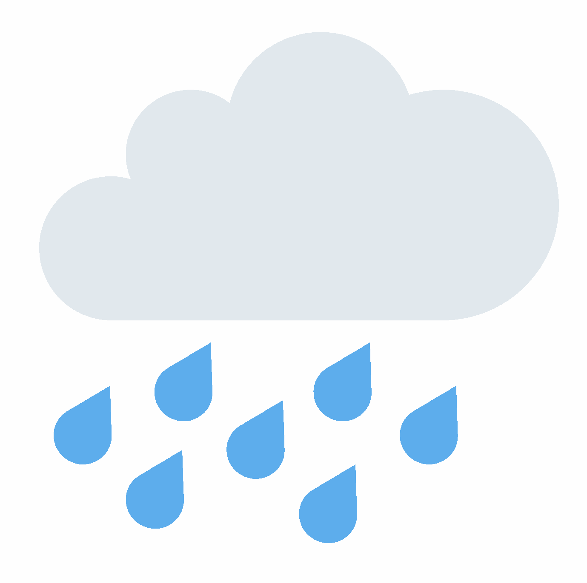

 

  <h1><b>rain</b></h1>
  
<i>A custom Discord client for Mobile! Designed to be lightweight and feature packed.</i>

  
  
  

## Install rain
> [!NOTE]
> rain is currently in beta. **Expect things to break and report bugs when you find them**

### Android

- **[rainManager](https://codeberg.org/raincord/rainManager/releases/latest)**

### iOS

- **[rainTweak](https://codeberg.org/raincord/RainTweak/releases/latest)**

## How can I support the project?

rain can be supported in many ways, you can [contribute](#contributing), make a [bug report](#bug-reporting) or [donate](https://www.ko-fi.com/cocobo1)!

## Bug-reporting

Bug reports are a crucial part of development, they make the project more stable and make developers aware of issues. Before filing an [issue](https://codeberg.org/raincord/rain/issues) please make sure it isnt a duplicate.

## Contributing

Discover how you can contribute at [contribution.md](contribution.md)!
